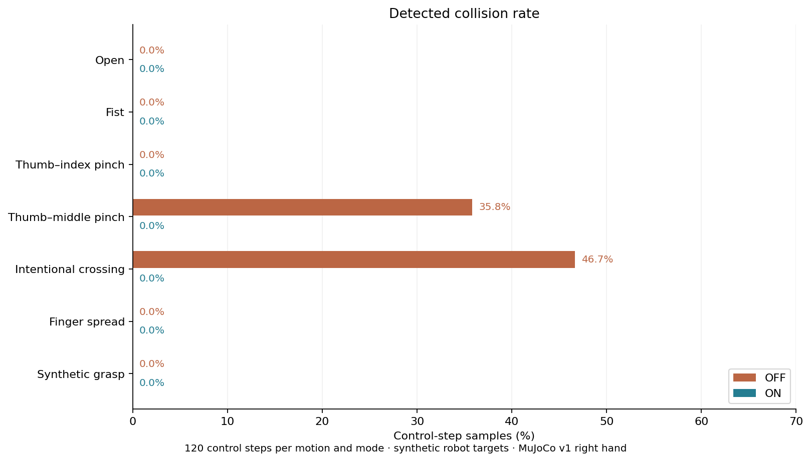
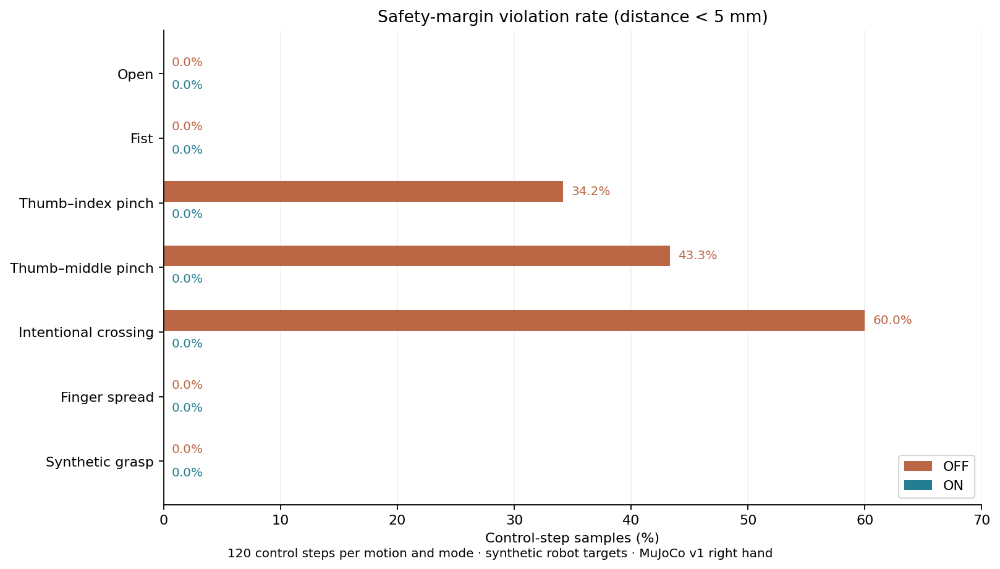

# Synthetic-Motion Safety OFF/ON Comparison

[中文](README.zh.md) | [English](README.md) | [한국어](README.ko.md)

This experiment compares the same robot target motions with the Safety Layer disabled and enabled.

Across seven fixed trajectories, ON detected neither collisions nor gaps below 5 mm. The tradeoff is that some motions do not fully follow the nominal targets, and filtering adds computation time.

## 1. Experiment Procedure

Robot joint targets are generated directly, without MediaPipe or the Adaptive Analytical Retargeter.

```text
Identical synthetic target trajectory q_nominal
    ├── Safety OFF: monitoring only → MuJoCo → record actual state
    └── Safety ON: CBF-QP + validation/fallback → MuJoCo → record actual state
```

- **Robot model**: OrcaHand v1 right hand, 17 joints.
- **Parameters**: safe distance 5 mm; CBF activation distance 15 mm.
- **Length**: 120 control steps per motion per mode. Each step advances simulation by 10 ms, giving 1.2 seconds per trajectory and 840 steps per mode.
- **Trajectory**: except for holding open, move from the open pose toward the target, briefly hold, then return open.

The seven motions are:

- `open`: hold the open pose.
- `fist`: close into a fist, then reopen.
- `thumb_index_pinch`: thumb–index pinch.
- `thumb_middle_pinch`: thumb–middle pinch.
- `intentional_collision`: a target intended to cross the fingers.
- `spread`: finger abduction.
- `assembly_like_synthetic`: synthetic grasp, not a recording of a real assembly task.

The 120 steps specify a fixed input duration, not verified task completion. The script sends targets on a schedule instead of waiting for the hand to reach each pose. Except for holding open, the sequence is approximately 42 approach steps (0.42 s), 36 hold steps (0.36 s), and 42 return steps (0.42 s), all in simulation time.

This experiment evaluates collisions, clearance, and interventions within a fixed time window; it does not establish successful completion of a fist or pinch task.

## 2. Collision and Clearance Results

Two metrics are distinguished:

- **Collision Rate**: fraction of control steps with a detected collision between configured link pairs.
- **Safety-margin Violation Rate**: fraction of steps with actual minimum clearance below 5 mm. Insufficient clearance is not necessarily a collision.

The plots show sampled rates for each motion. A value of 0% means no such event was detected in these samples.





### Thumb–Index Pinch

OFF had no detected collisions, but **41/120 steps (34.2%)** were below 5 mm; minimum clearance was approximately **0.99 mm**.

ON had no detected margin violations; minimum clearance was approximately **5.54 mm**.

### Thumb–Middle Pinch

OFF detected collisions in 43/120 steps (35.8%) and margin violations in 52/120 steps (43.3%).

ON had 0/120 for both metrics; minimum clearance was approximately 5.58 mm.

### Intentional Crossing

OFF detected collisions in 56/120 steps (46.7%) and margin violations in 72/120 steps (60.0%).

ON had 0/120 for both metrics; minimum clearance was approximately 5.42 mm.

### Other Four Motions

Open, fist, spread, and synthetic grasp had no detected collisions or margin violations in either OFF or ON.

## 3. How Often the Safety Layer Changes Commands

Intervention Rate counts steps with `||q_safe − q_nominal||₂ > 1e-5 rad`. It measures modification frequency, not modification magnitude or fallback count.

ON results:

- Open and synthetic grasp: **0%** each.
- Spread: **0.8%**, or 1/120 steps.
- Fist: **26.7%**, or 32/120 steps.
- Thumb–index: **35.0%**, or 42/120 steps.
- Thumb–middle: **55.0%**, or 66/120 steps.
- Intentional crossing: **70.8%**, or 85/120 steps.

For the three approach/collision motions, mean target modification norms were approximately **0.0375, 0.1201, and 0.1256 rad**, respectively.

Fist had no OFF violations, yet ON modified some targets, showing that the QP Safety Filter can constrain motion before a violation occurs.

## 4. Runtime

Existing results record only the **mean duration of a single ON safety-layer call**, in ms:

- Open: **27.6 ms**.
- Fist: **47.1 ms**.
- Thumb–index: **34.4 ms**.
- Thumb–middle: **33.7 ms**.
- Intentional crossing: **42.8 ms**.
- Spread: **22.2 ms**.
- Synthetic grasp: **26.8 ms**.
